# Predicting System Outages Using Classification

## Business Understanding

The purpose of this project is to determine if there is a way to predict whether a computer system ('system' in this context has several meanings: a series of computer clusters, a computer cluster and a node within a cluster) will experience an outage. The data used for this effort was from the [Los Alamos Ultrascale Systems Research Center (USRC)](https://usrc.lanl.gov/data/failure-data.php), "USRC Data Sources Failure Data". This data is unique since there does not existst a robust (and large), publicly-available data set depicting system outages for a large-scale system of computer clusters spanning a significant period of time (December 1996 - November 2005). The data represents 24 computer clusters ranging from 1 to 1024 nodes each, using a combination of memory, memory types and CPU types (the actual "types" are represented numerically).
This outage data was recorded manually for each system at the node level when an outage occured, when it was resolved and the reason for the outage. The reason for the utage include "Facilities, Hardware, Human Error, Network, Undetermined". 

## Data Understanding

The 22 systems were put online at different times over this period and remained in service for varying durations.

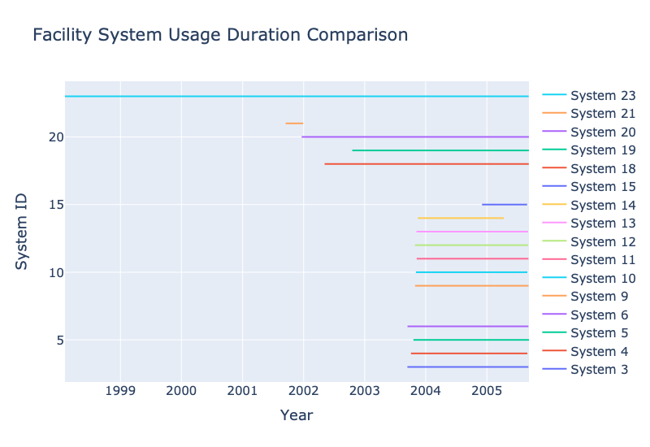

For this project, a sub-set of data (systems 18, 19 & 20) was selected since the data set provided by USRC was large and spanned diverse systems (size, memory & CPU type) in service at different times.

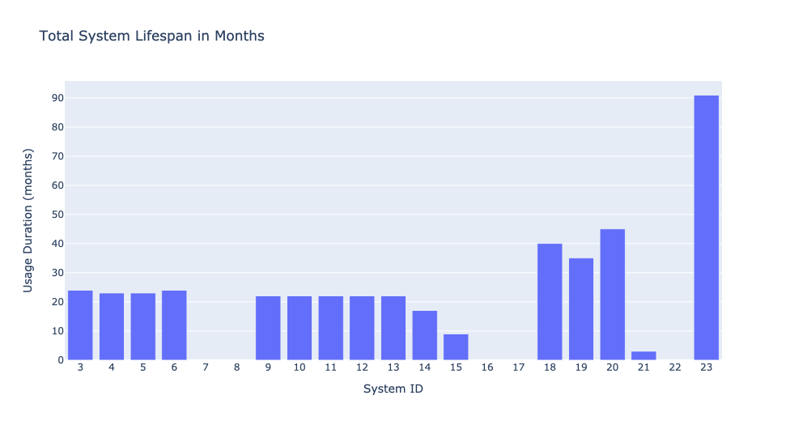

Furthermore, these three systems contained the same memory/CPU combination and their respective outage records included the largest number of nodes (out of 1024).

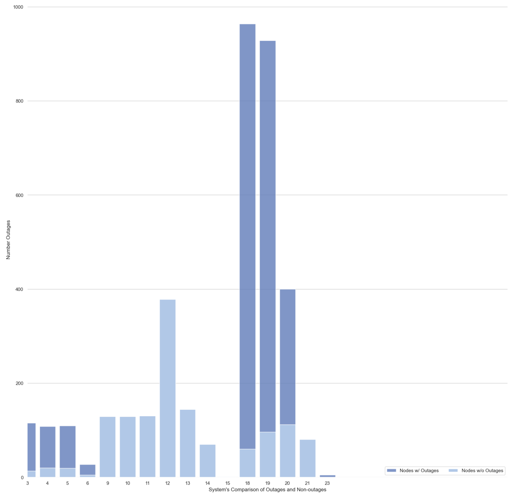

 The categories of interest are Hardware and Software both containing sub-categories which were not analized separately. The other, before-mentioned categories were ignored since they contained one or two sub-categories, not adding value to the data variance.

 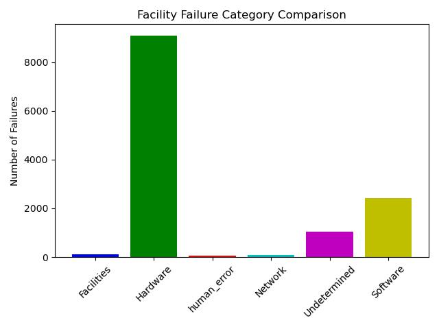

 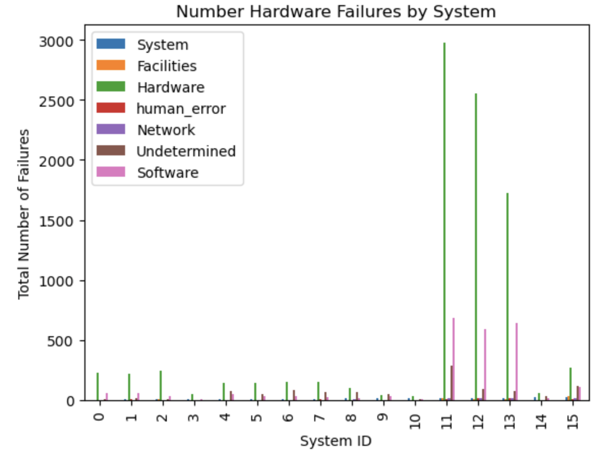

 ## Data Preparation

 The USRC data provided outages of the systems/sub-systems. Each entry contains a "problem" start and end timestamp (eg. 2003-09-12 13:57:00) to the minute precision. Below is a visual prepresentation of the failures within systems 18-20:
 
 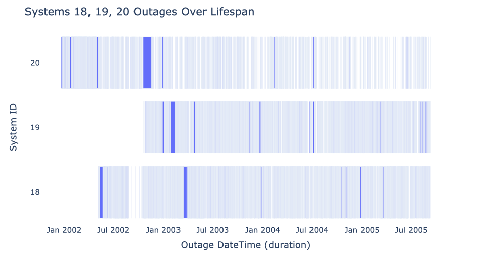
 
 For a classification problem, these outages were annotated in the "is_outage" column as "yes". However, no information existed for the "non-outage" periods. Since the data provided was on the node level, entries needed to be generated for each system based on when a node did not exhibit a problem. This was accomplished with a script by identifying the first (start) and last (end) outage timestamp and computing the number of minutes inbetween. An array initialized to -1 was created of this length and each system's sorted (by problem start timestamp) outage data was recorded on the corresponding array indices ("minutes") with the DataFrame index.

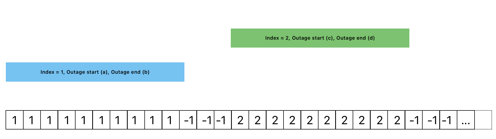

For each generated "non-outage", the previous array index was inspected and the corresponding DataFrame row was copied. The outage start, end and duration were adjusted accordingly. Below is a plot of system's 18 node 0 outage and synthesized non-outage (displaying the system-wide plot would result in solid blocks due to granularity):

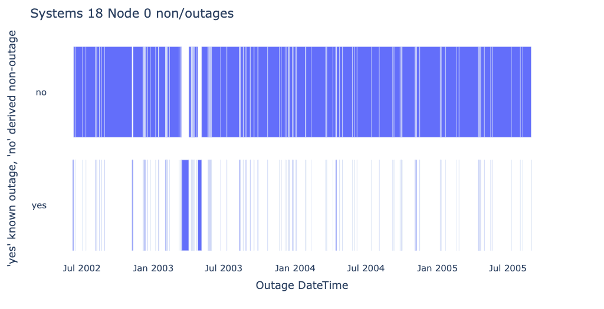

This process, for system 18, added 2523 non-outage records to the existing 3997 outage records.

It is important to note that this approach is over-simplistic. First, an assumption was made that a non-outage was associated with the last-recorded outage. Second, it did not account for outage overlaps. In some instances, an outage for a node was recorded with a "start" timestamp, containing an unique reason. It was followed by a later outage for the same node with another reason; both ending at the same time. This approach did not capture these distinctions. In this particular case, the second-recorded reason was actually the culprit.

Before the decision to only use the Hardware and Software categories was made, correlations were computed for each column. 'correlations 1' was generated by categorizing the NaN entries using `astype('category').cat.codes`. 'correlations 2' was generated by also converting the "problem start datetime" and "problem end datetime" columns to `int64`.

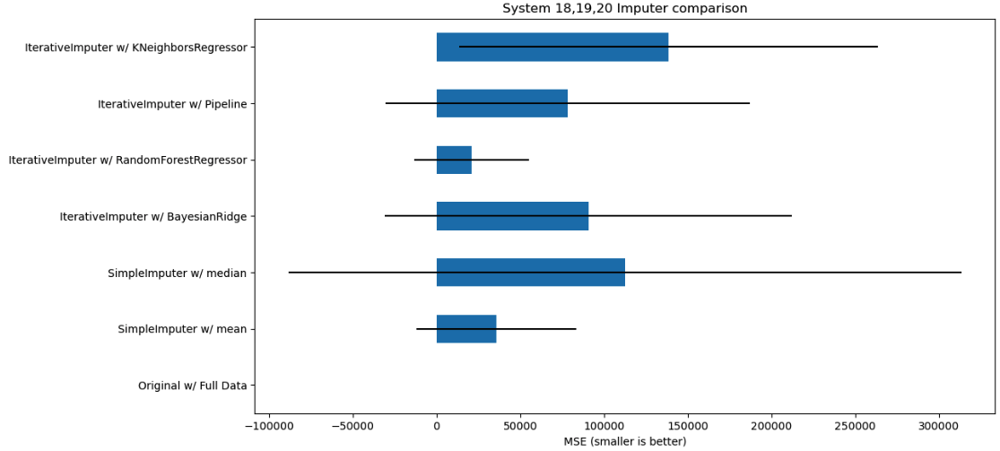

The "IterativeImputer w/ RandomForestRegressor" was identified as the best imputer/regressor combination. `GridSearchCV` was used to indentify the best parameters which was used to impute the data; 'correlation 3'.

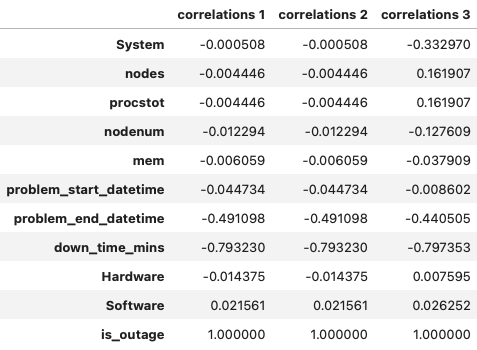

The non/outages for each system were plotted:

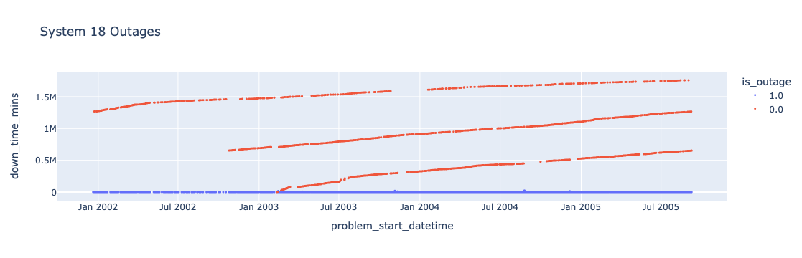
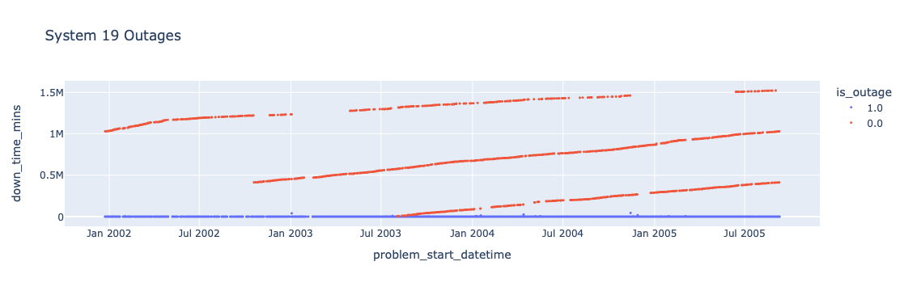
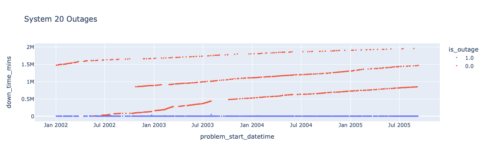

In these system-specific plots, show that non-outages (the synthesized data) lasted considerably longer (y-axis) than the recorded outages, in blue, hovering along the x-axis. It is unclear why each of these contains the similar patterns of three distinct non-outage lines (red), increasing over the lifespan of each system. If this feature is correct, then it suggests that hardware and software outages became less frequent as the system matured.

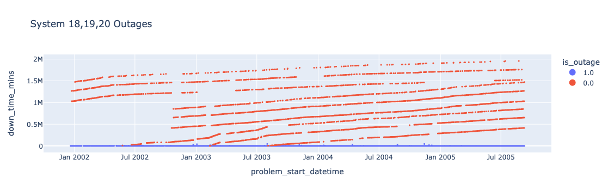

When combined, the same pattern is seen and is staggered. If we return to the "System 18, 19, 20 Outages Over Lifespan" plot above, we see that the recording of system outages started on different dates.

## Modeling

Five Classifiers from Scikit-learn were selected (`KNeighborsClassifier, SVC, DecisionTreeClassifier, GaussianNB (Gaussian Naive Bayes), RandomForestClassifier`). For each, a Pipeline was constructed, prefaced by a `StandardScaler`. Each Pipeline was then ran through `GridSearchCV` to identify the best hyperparameters. `SVC` was abandonned at this phase since it did not complete within 12 hours. The documentation indicates that it is not a good candidate for large data sets (here, 15,992 entries). The data was `X` contained the "problem start datetime", converted to `int64` and `y` containing the "is outage" column. Both were shuffled (since the data was sorted by "problem start datetime") and split into a 30% training set and a 70% testing set.

The hyperparameters (and later-fitted models) were ran on three sets of the data:
1. the entire dataset (systems 18,19,20) - suffix "ALL"
2. system 18 - suffix "Sys 18"
3. system 18 node 0 - suffix "Sys 18 Node 0"

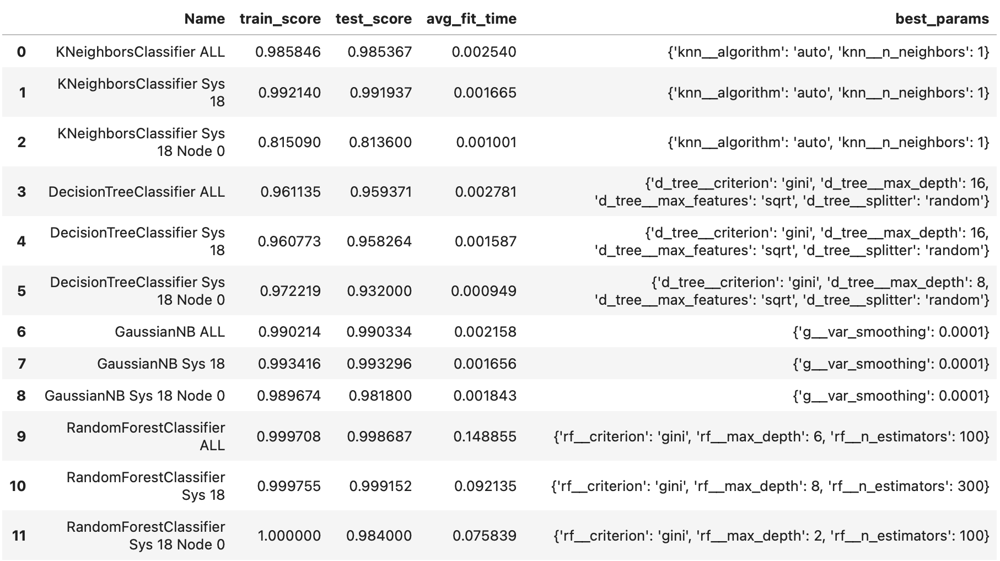

The `DecisionTreeClassifier` hyperparameter of `max_depth` (#5) differed when the data set was smallest (system 18, node 0). This makes intuitive sense since there was significantly less data to classify as opposed to the larger data sets (174 vs 15,922 & 6,520). What is also interesting is that the `RandomForestClassifier`'s `max_depth` and `n_estimators` best parameters were highest for the middle (6,520) dataset.

Once fitted with their respective best hyperparameters, each combination of model and data was trained and scored:

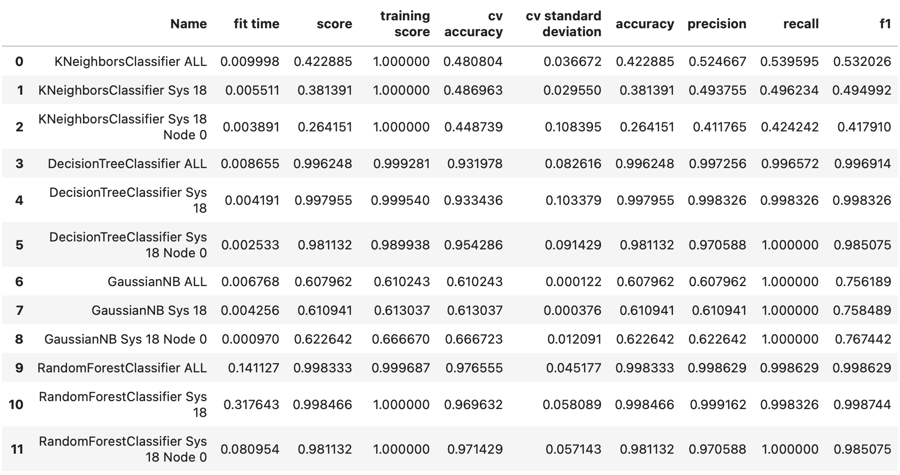

**Fit Time**
Each model exhibited fit times proportionately to the size of data except for the above-mentioned `RandomForestClassifier` with `GaussianNB` out-performing its rivals.
**Score**
`KNeighborsClassifier` achieved the worst score. However, aside from `GaussianNB`, the other classifiers achieved scores approaching 1.0 suggesting overfitting.
**Training Score**
Overall, it is suspicious that in most instances the classifiers achieved almost a perfect training score. This suggests poor generalization and overfitting.
**Cross-validation Accuracy & Standard Deviation**
A high cross-validation (cv) accuracy score and a low cv standard deviation score indicate how well the model(s) performed. Again, cv accuracy scores nearing 1.0 are suspect (`DecisionTreeClassifier, RandomForestClassifier`). `GaussianNB` seems to be the winner in these two categories.
**Accuracy**
Unless the model is required for a "life or death" purpose (here, we want to be able to predict when a computer system will experience an outage), accuracy scores approaching 1.0 are suspect. `KneighborsClassifier` had worsening scores as the data set decreased in size; which makes intuitive sense. The better performer was `GaussianNb`.
**F1, Accuracy & Precision**
The F1 score reflects the balance between accuracy and precision. This is the most meaningful metric of the three. Again, assuming that scores approaching 1.0 are suspect, `GaussianNB` performed the best.

These scores can be visualized using ROC curves:

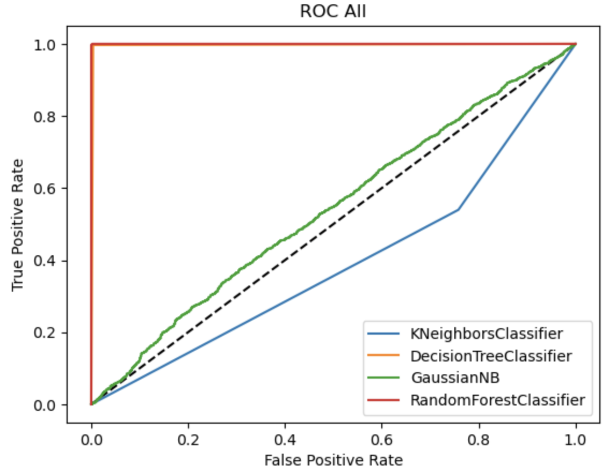
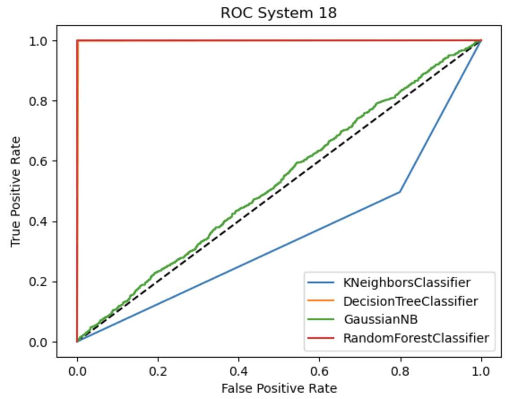
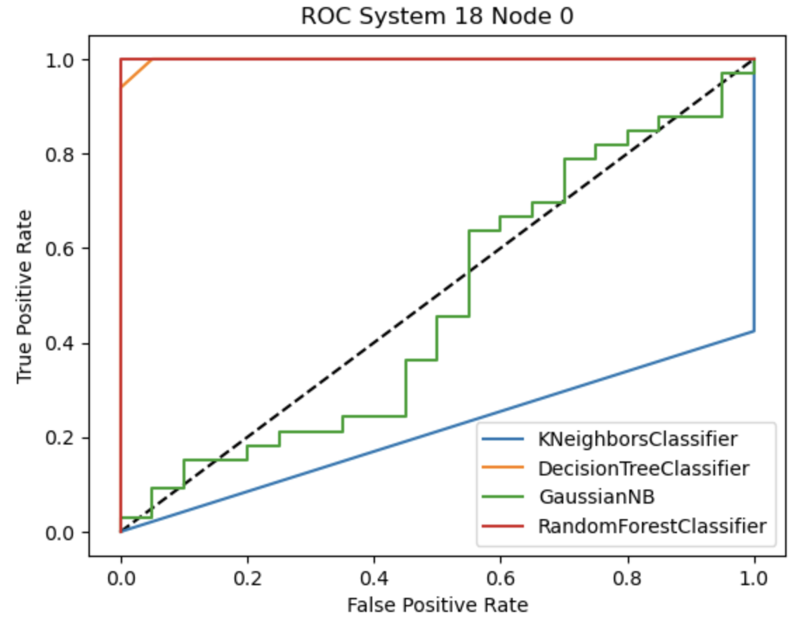

Here, we see that `KneighborsClassifier` did not perform well at all. Both `DecisionTreeClassifier` and `RandomForestClassifier` seem to be overfit. The poorest, yet plausible model was `GaussianNB`. It is interesting to witness the models' change in performance based on data set size. Using the smallest dataset (System 18, Node 0) `GaussianNB` displays erratic behavior.

In the "ALL" confusion matrices, we see that`RandomForestClassifier` performed the best. However, `GaussianNB`, our favorite for its F1 score had 1,881 false-positives.

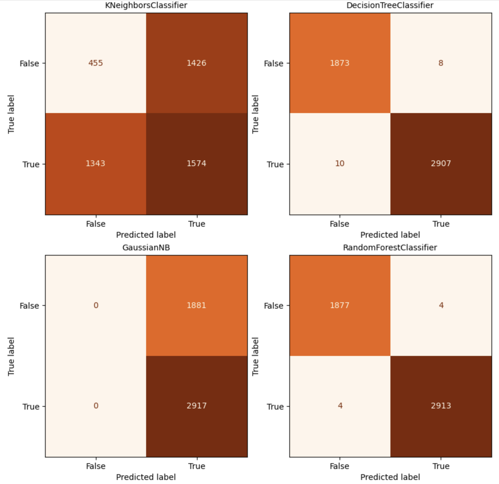

Similar behavior is seen when the dataset only includes system 18.

And again, when the data only includes system 18, node 0.

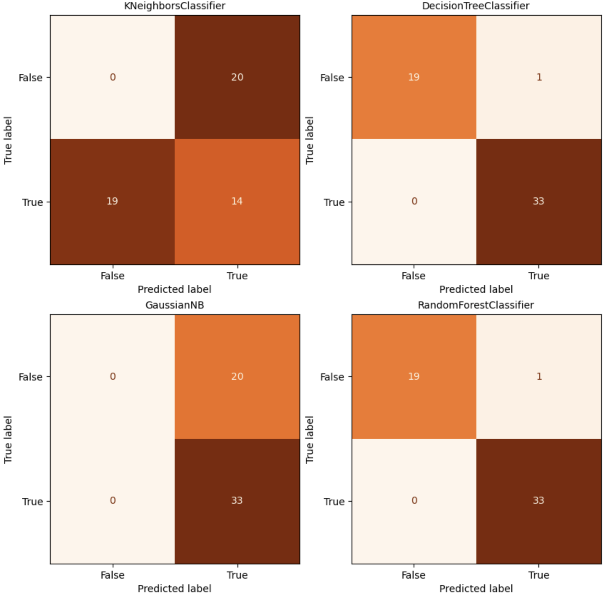

**Evaluation**

We see from the scores and plots above that none of the selected models performed well overall. I have already mentioned the "questionable" means of synthesizing the non-outages. Another culprit can be the uneven distribution of hardware and software-related outages: both to themselves as well as to their respective sup-categories.

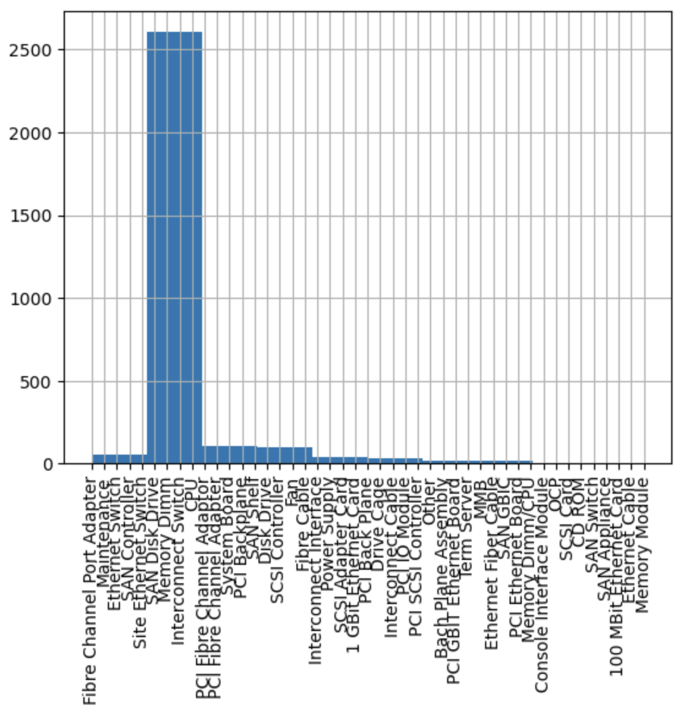
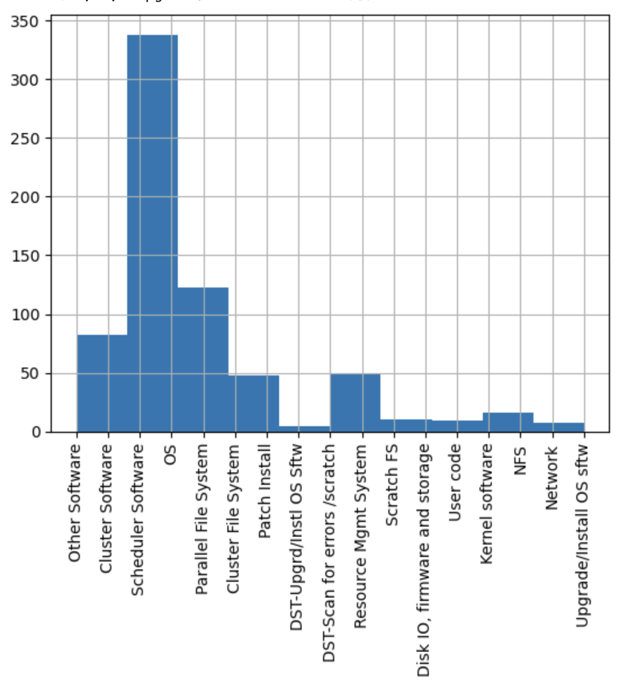

Another reason for this poor performance can be attributed to how these failures were recorded; by hand. Meaning, that when an outage was identified (it is not clear *how*), there was a span of time before a human entered the data into the system. Another reason could be outage missclassification (eg. 'software' when it was actually 'hardware'). We saw in the correlation tables how poorly the features were correlated, even after utilizing the `IterativeImputer`.
